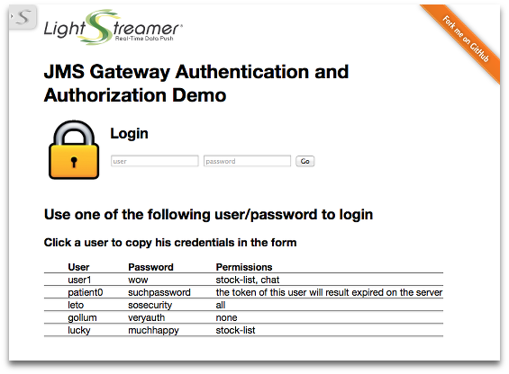

# Lightstreamer JMS Gateway - Authentication and Authorization Demo - HTML Client

The JMS Gateway Authentication and Authorization Demo is a simple example illustrating *authentication* and *authorization* mechanisms when an
*external Web/Application Server* is involved in the process.

This project includes a simple web client front-end example for the [Lightstreamer JMS Gateway - Authentication and Authorization Demo - Java Hook](https://github.com/Weswit/Lightstreamer-JMS-example-Auth-hook-java).

## Live Demo

[](http://demos.lightstreamer.com/JMSAuthDemo)

###[ View live demo](http://demos.lightstreamer.com/JMSAuthDemo)

## Details

This *Authentication and Authorization Demo* illustrates the typical best practice used for Lightstreamer JMS Gateway Web applications, when a Web/Application server is involved in the process.
The actual authentication is usually handled by the legacy Web/Application server, irrespective of Lightstreamer.

From `src/index.js`:

```js
[...]

$.ajax({
  url: "js/login.js",
  type: "POST",
  data: {
    user: user,
    password: password,
  },

[...]
```

Some sort of token is sent back to the Client through cookies, response payload or any other technique.
When the JMS Javascript Client creates the JMS connection, instead of sending again the full credentials (usually involving a password) to
the JMS Gateway, it sends just the username and the token.

From `src/index.js`:

```js
[...]

// Now we can connect to JMS Gateway
ConnectionFactory.createConnection(Constants.SERVER, Constants.ADAPTER_SET, Constants.DATA_ADAPTER,
    user, token, {
        onConnectionCreated: function(conn) {

[...]
```

The Hook is passed this information and validates the token against the Web/Application Server that
generated it (or a database or whatever back-end system).

Here is an overview of the whole sequence:


In this demo client the Web/Application server is not actually involved and calls to placeholder methods are performed to obtain and extract the token.

Once the user is authenticated on the JMS Gateway server as explained above, the client interface opens three different panels: a stock-list panel,
a portfolio panel and a chat panel. Each panel tries to create consumers and producers for different destination. Each time creation is requested,
the JMS Gateway proceeds with the authorization of the request; each one of the username available im the demo is bound to a list of destinations
it is authorized to view. Again the server might use an external service to verify if the received request is a valid one or not:
more details on this are shown in the [Hook project](https://github.com/Weswit/Lightstreamer-JMS-example-Auth-hook-java).


## Install

Before you can run the demo of this project some dependencies need to be solved:

* Note that, as prerequisite, the following projects have to be deployed on your local Lightstreamer Server instance (running a properly configured JMS Gateway). Please check out the projects and follow the installation instructions provided with them:
  * [Lightstreamer JMS Gateway - Stock-List Demo - Java (JMS) Service](https://github.com/Weswit/Lightstreamer-JMS-example-StockList-service-java)
  * [Lightstreamer JMS Gateway - Portfolio Demo - Java (JMS) Service](https://github.com/Weswit/Lightstreamer-JMS-example-Portfolio-service-java)
  * [Lightstreamer JMS Gateway - Basic Chat Demo - Java (JMS) Service](https://github.com/Weswit/Lightstreamer-JMS-example-Chat-service-java)
* Install the [JMS Gateway Hook](https://github.com/Weswit/Lightstreamer-JMS-example-Auth-hook-java) required by this project:
* Launch Lightstreamer Server and the three JMS demo services above.
* Get the `lightstreamer-jms.js` file from the [Lightstreamer JMS Gateway](http://download.lightstreamer.com/#jms) and put it in the `src/js` folder of this project.
* Lightstreamer JS client is currently hot-linked in the html page: you may want to replace it with a local version and/or to upgrade its version.
* RequireJS is currently hot-linked in the html page: you may want to replace it with a local version and/or to upgrade its version.
* jQuery is currently hot-linked in the html page: you may want to replace it with a local version and/or to upgrade its version.

Now, you need to configure the `src/js/Constants.js` of this example by specifying the name of the data adapter you are going to use.
By default the demo will look for the <b>HornetQ</b> data adapter, please refer to the related services projects ([Stock-List Demo](https://github.com/Weswit/Lightstreamer-JMS-example-StockList-service-java),
[Portfolio Demo](https://github.com/Weswit/Lightstreamer-JMS-example-Portfolio-service-java) or [Chat Demo](https://github.com/Weswit/Lightstreamer-JMS-example-Chat-service-java))
for more details on the choice of a JMS broker to be used.

To set the data adapter name and the connection name look where the Constants object is returned:

```js
[...]

return {
    SERVER: protocolToUse + "//localhost:8080",
    ADAPTER_SET: "JMS",
    DATA_ADAPTER: "HornetQ",

[...]
```

To access the demo from a web browser copy it somewhere under your root webserver directory. You can also add it to the standard Lightstreamer
demo pages under `LightstreamerHome/pages/demos` directory by copying there the `src` folder and giving it a name such as `AuthDemo_JMS`. Subsequently
you may access it as: <i>http://_your_lightstreamer_http_address_/demos/AuthDemo_JMS/</i>.

## See Also

### JMS Gateway Hook Needed by This Client

* [Lightstreamer JMS Gateway - Authentication and Authorization Demo - Java Hook](https://github.com/Weswit/Lightstreamer-JMS-example-Auth-hook-java)

## Lightstreamer Compatibility Notes

* Compatible with Lightstreamer JavaScript Client library version 6.1 or newer.
* Compatible with Lightstreamer JMS Gateway Adapter since version 1.1.1 or newer.
